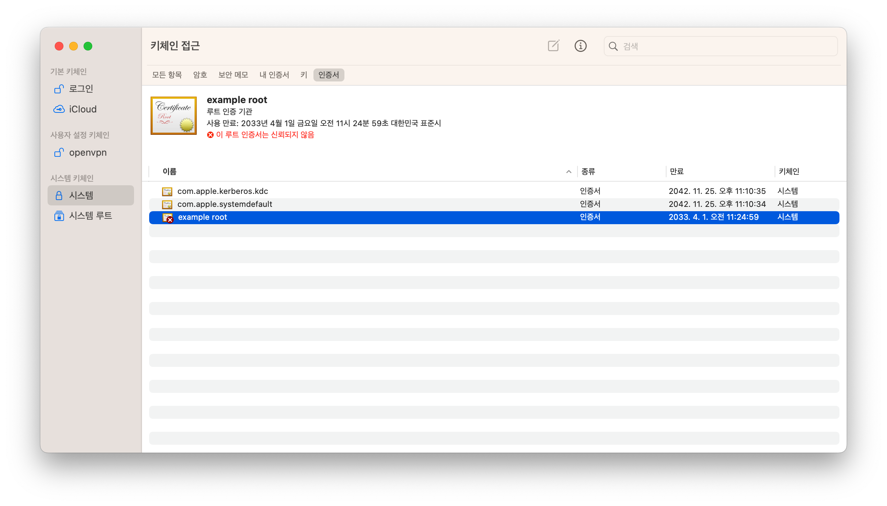
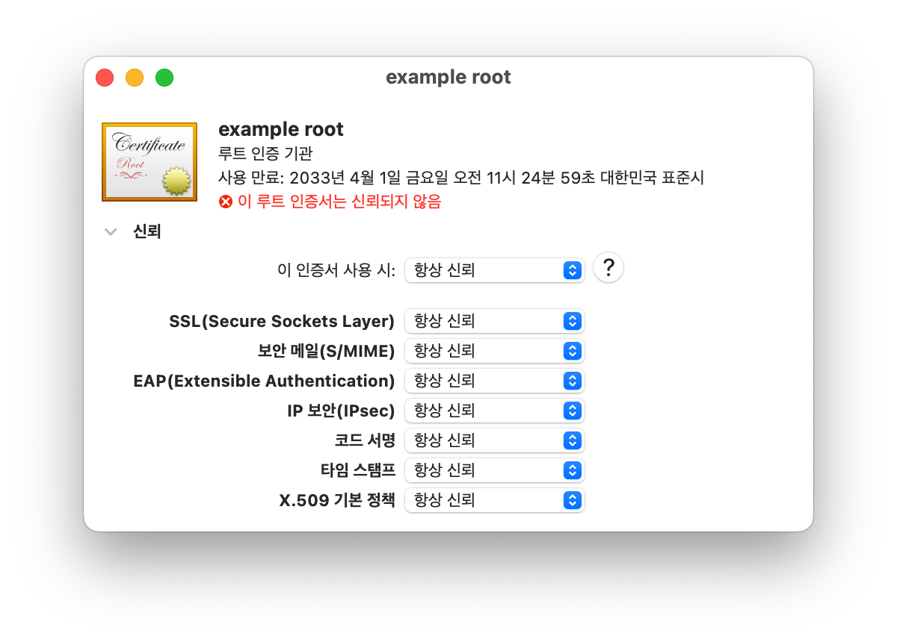

# OpenSSL을 이용한 mTLS

[TOC]

> Demo App: https://github.com/Great-Stone/vault-mtls-demo

Vault를 사용하지 않고 OpenSSL을 활용하여 mTLS 구현

## 1. Root CA 인증서

### 1.1. Root Key 생성

Root CA 인증서 생성을 위한 Root Key를 생성

[Command]

```bash
cd cert
```

```bash
openssl genrsa -out root.key 2048
```


### 1.2. Root CA 요청서(CSR) 생성

`root.key`를 이용하여 Root CA 인증서 생성을 위한 요청서(CSR)를 생성

[`XXX.conf` 파일 예시]

| 구분                                                 | 작성 예     |
| :--------------------------------------------------- | :---------- |
| Country Name (국가코드)                              | KR          |
| State or Province Name (시/도의 전체이름)            | Seongnam-si |
| Locality Name (시/군/구 등의 이름)                   | Bundang-gu  |
| Organization (회사이름)                              | DDIM        |
| Organization Unit (부서명)                           | Engineer    |
| Common Name (SSL 인증서를 설치할 서버의 Full Domain) | www.xxx.com |

[Command]

```bash
openssl req -config ca.conf -extensions usr_cert -new -key root.key -out ca.csr
```

```bash
openssl req -text -in ca.csr
```

[Output]

```
Certificate Request:
    Data:
        Version: 0 (0x0)
        Subject: C=KR, ST=Seongnam-si, L=Bundang-gu, O=DDIM, OU=Engineer/emailAddress=example@example.com, CN=example root
        Subject Public Key Info:
            Public Key Algorithm: rsaEncryption
                RSA Public-Key: (2048 bit)
                Modulus:
                    <...생략...>
                Exponent: 65537 (0x10001)
        Attributes:
        Requested Extensions:
            X509v3 Basic Constraints:
                CA:TRUE
    Signature Algorithm: sha256WithRSAEncryption
         <...생략...>
-----BEGIN CERTIFICATE REQUEST-----
<...생략...>
-----END CERTIFICATE REQUEST-----
```


### 1.3. Root CA 인증서 생성

생성한 요청서(CSR)에 대해 자체 서명하여 Root CA 인증서를 생성

[Command]

```bash
openssl x509 -req -days 3650 -in ca.csr -signkey root.key -extfile ca.ext -out ca.crt
```

* `-days`: 인증서 기간 10년
* `-extfile`: 서명시 추가 정보에 대한 내용

[Output]

```
Signature ok
subject=/C=KR/ST=Seongnam-si/L=Bundang-gu/O=DDIM/OU=Engineer/emailAddress=example@example.com/CN=example root
Getting Private key
```

[Command]

```bash
openssl x509 -text -noout -in ca.crt
```

[Output]

```
Certificate:
    Data:
        Version: 3 (0x2)
        Serial Number:
            cb:55:08:48:fa:7a:7d:61
    Signature Algorithm: sha256WithRSAEncryption
        Issuer: C=KR, ST=Seongnam-si, L=Bundang-gu, O=DDIM, OU=Engineer/emailAddress=example@example.com, CN=example root
        Validity
            Not Before: Apr  4 02:24:59 2023 GMT
            Not After : Apr  1 02:24:59 2033 GMT
        Subject: C=KR, ST=Seongnam-si, L=Bundang-gu, O=DDIM, OU=Engineer/emailAddress=example@example.com, CN=example root
        Subject Public Key Info:
            Public Key Algorithm: rsaEncryption
                RSA Public-Key: (2048 bit)
                Modulus:
                    <...생략...>
                Exponent: 65537 (0x10001)
        X509v3 extensions:
            X509v3 Basic Constraints:
                CA:TRUE
    Signature Algorithm: sha256WithRSAEncryption
         <...생략...>
```


### 1.4. Root CA 인증서 시스템 등록

[MacOS]

1. `ca.crt` 더블 클릭

2. 키체인 접근

3. 사이드바 `시스템` -> 상단 `인증서` 탭 -> `CN` 값으로 지정한 이름의 인증서 더블클릭

   

4. `신뢰` 항목 -> `이 인증서 사용 시`를 `항상 신뢰`로 변경

